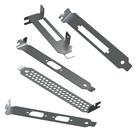
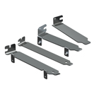
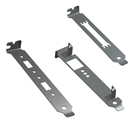

# PCI-PCIe_device
plan to design and build my own PCI/PCIe cards 


### PC Card Computer Brackets


<p float="left">
  
  
  
</p>


```
https://www.keyelco.com/category.cfm/Brackets-Computer-Mounting/Computer-Brackets-PC-Card/id/427

https://superuser.com/questions/1365468/what-is-the-name-of-that-metal-stripe-which-holds-pci-cards

https://www.brackets.nl/downloads


```
