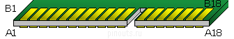
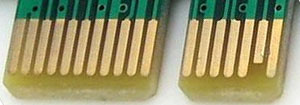
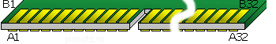
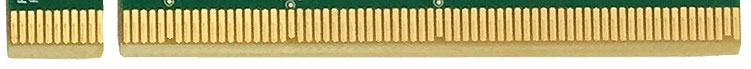
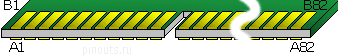

PCI Express (PCIe, PCI-e) is a high-speed serial computer expansion bus standard.


```
PCI Express as a high-bandwidth, low pin count, serial, interconnect technology. It was designed to replace the older PCI and AGPbus standards. PCIe has numerous improvements over the older standards, including higher maximum system bus throughput, lower I/O pin count and smaller physical footprint, better performance scaling for bus devices, a more detailed error detection and reporting mechanism (Advanced Error Reporting, AER), and native hot-swap functionality. PCI Express architecture provides a high performance I/O infrastructure for Desktop Platforms with transfer rates starting at 2.5 Giga transfers per second over a x1 PCI Express lane for Gigabit Ethernet, TV Tuners, Firewire 1394a/b controllers, and general purpose I/O. PCI Express architecture provides a high performance graphics infrastructure for Desktop Platforms doubling the capability of existing AGP8x designs with transfer rates of 4.0 Gigabytes per second over a x16 PCI Express lane for graphics controllers. A lane is composed of two differential signaling pairs, with one pair for receiving data and the other for transmitting.

ExpressCard utilizing PCI Express interface, developed by the PCMCIA group for mobile computers. PCI Express Advanced Power Management features help to extend platform battery life and to enable users to work anywhere, without an AC power source. The PCI Express electrical interface is also used in some computer storage interfaces SATA Express and M.2.

The broad adoption of PCI Express in the mobile, enterprise and communication segments enables convergence through the re-use of a common interconnect technology.

PCI-E is a serial bus which uses two low-voltage differential LVDS pairs, at 2.5Gb/s in each direction [one transmit, and one receive pair]. PCI Express supports 1x [2.5Gbps], 2x, 4x, 8x, 12x, 16x, and 32x bus widths [transmit / receive pairs].

The differential pins [Lanes] listed in the pin out table above are LVDS which stands for: Low Voltage Differential Signaling.
```


### Source 

```
https://pinoutguide.com/Slots/pci_express_pinout.shtml

```


### PCI-Express 1x Connector Pin-Out






| Pin | Side B Connector | Description                   | Side A Connector | Description                          |
|-----|------------------|-------------------------------|------------------|--------------------------------------|
| 1   | +12v             | +12 volt power                | PRSNT#1          | Hot plug presence detect             |
| 2   | +12v             | +12 volt power                | +12v             | +12 volt power                       |
| 3   | +12v             | +12 volt power                | +12v             | +12 volt power                       |
| 4   | GND              | Ground                        | GND              | Ground                               |
| 5   | SMCLK            | SMBus clock                   | JTAG2            | TCK                                  |
| 6   | SMDAT            | SMBus data                    | JTAG3            | TDI                                  |
| 7   | GND              | Ground                        | JTAG4            | TDO                                  |
| 8   | +3.3v            | +3.3 volt power               | JTAG5            | TMS                                  |
| 9   | JTAG1            | +TRST#                        | +3.3v            | +3.3 volt power                      |
| 10  | 3.3Vaux          | 3.3v volt power               | +3.3v            | +3.3 volt power                      |
| 11  | WAKE#            | Link Reactivation             | PERST#           | PCI-Express Reset signal             |


Mechanical Key

| Pin | Side B Connector | Description                   | Side A Connector | Description                          |
|-----|------------------|-------------------------------|------------------|--------------------------------------|
| 12  | RSVD             | Reserved                      | GND              | Ground                               |
| 13  | GND              | Ground                        | REFCLK+          | Reference Clock (Differential pair) |
| 14  | HSOp(0)          | Transmitter Lane 0 (Diff pair)| REFCLK-          | Reference Clock (Differential pair) |
| 15  | HSOn(0)          | Transmitter Lane 0 (Diff pair)| GND              | Ground                               |
| 16  | GND              | Ground                        | HSIp(0)          | Receiver Lane 0 (Differential pair) |
| 17  | PRSNT#2          | Hotplug detect                | HSIn(0)          | Receiver Lane 0 (Differential pair) |
| 18  | GND              | Ground                        | GND              | Ground                               |


### PCI-Express 4x Connector Pin-Out





| Pin | Side B Connector | Description                        | Side A Connector | Description                          |
|-----|------------------|------------------------------------|------------------|--------------------------------------|
| 1   | +12v             | +12 volt power                     | PRSNT#1          | Hot plug presence detect             |
| 2   | +12v             | +12 volt power                     | +12v             | +12 volt power                       |
| 3   | +12v             | +12 volt power                     | +12v             | +12 volt power                       |
| 4   | GND              | Ground                             | GND              | Ground                               |
| 5   | SMCLK            | SMBus clock                        | JTAG2            | TCK                                  |
| 6   | SMDAT            | SMBus data                         | JTAG3            | TDI                                  |
| 7   | GND              | Ground                             | JTAG4            | TDO                                  |
| 8   | +3.3v            | +3.3 volt power                    | JTAG5            | TMS                                  |
| 9   | JTAG1            | +TRST#                             | +3.3v            | +3.3 volt power                      |
| 10  | 3.3Vaux          | 3.3v volt power                    | +3.3v            | +3.3 volt power                      |
| 11  | WAKE#            | Link Reactivation                  | PERST#           | PCI-Express Reset signal             |


Mechanical Key

| Pin | Side B Connector | Description                        | Side A Connector | Description                          |
|-----|------------------|------------------------------------|------------------|--------------------------------------|
| 12  | RSVD             | Reserved                           | GND              | Ground                               |
| 13  | GND              | Ground                             | REFCLK+          | Reference Clock (Differential pair) |
| 14  | HSOp(0)          | Transmitter Lane 0 (Diff pair)     | REFCLK-          | Reference Clock (Differential pair) |
| 15  | HSOn(0)          | Transmitter Lane 0 (Diff pair)     | GND              | Ground                               |
| 16  | GND              | Ground                             | HSIp(0)          | Receiver Lane 0 (Differential pair) |
| 17  | PRSNT#2          | Hotplug detect                     | HSIn(0)          | Receiver Lane 0 (Differential pair) |
| 18  | GND              | Ground                             | GND              | Ground                               |
| 19  | HSOp(1)          | Transmitter Lane 1 (Diff pair)     | RSVD             | Reserved                             |
| 20  | HSOn(1)          | Transmitter Lane 1 (Diff pair)     | GND              | Ground                               |
| 21  | GND              | Ground                             | HSIp(1)          | Receiver Lane 1 (Differential pair) |
| 22  | GND              | Ground                             | HSIn(1)          | Receiver Lane 1 (Differential pair) |
| 23  | HSOp(2)          | Transmitter Lane 2 (Diff pair)     | GND              | Ground                               |
| 24  | HSOn(2)          | Transmitter Lane 2 (Diff pair)     | GND              | Ground                               |
| 25  | GND              | Ground                             | HSIp(2)          | Receiver Lane 2 (Differential pair) |
| 26  | GND              | Ground                             | HSIn(2)          | Receiver Lane 2 (Differential pair) |
| 27  | HSOp(3)          | Transmitter Lane 3 (Diff pair)     | GND              | Ground                               |
| 28  | HSOn(3)          | Transmitter Lane 3 (Diff pair)     | GND              | Ground                               |
| 29  | GND              | Ground                             | HSIp(3)          | Receiver Lane 3 (Differential pair) |
| 30  | RSVD             | Reserved                           | HSIn(3)          | Receiver Lane 3 (Differential pair) |
| 31  | PRSNT#2          | Hot plug detect                    | GND              | Ground                               |
| 32  | GND              | Ground                             | RSVD             | Reserved                             |


### PCI-Express 8x Connector Pin-Out


| Pin | Side B Connector | Description                         | Side A Connector | Description                          |
|-----|------------------|-------------------------------------|------------------|--------------------------------------|
| 1   | +12v             | +12 volt power                      | PRSNT#1          | Hot plug presence detect             |
| 2   | +12v             | +12 volt power                      | +12v             | +12 volt power                       |
| 3   | +12v             | +12 volt power                      | +12v             | +12 volt power                       |
| 4   | GND              | Ground                              | GND              | Ground                               |
| 5   | SMCLK            | SMBus clock                         | JTAG2            | TCK                                  |
| 6   | SMDAT            | SMBus data                          | JTAG3            | TDI                                  |
| 7   | GND              | Ground                              | JTAG4            | TDO                                  |
| 8   | +3.3v            | +3.3 volt power                     | JTAG5            | TMS                                  |
| 9   | JTAG1            | +TRST#                              | +3.3v            | +3.3 volt power                      |
| 10  | 3.3Vaux          | 3.3v volt power                     | +3.3v            | +3.3 volt power                      |
| 11  | WAKE#            | Link Reactivation                   | PERST#           | PCI-Express Reset signal             |


Mechanical Key


| Pin | Side B Connector | Description                         | Side A Connector | Description                          |
|-----|------------------|-------------------------------------|------------------|--------------------------------------|
| 12  | RSVD             | Reserved                            | GND              | Ground                               |
| 13  | GND              | Ground                              | REFCLK+          | Reference Clock (Differential pair) |
| 14  | HSOp(0)          | Transmitter Lane 0 (Differential)   | REFCLK-          | Reference Clock (Differential pair) |
| 15  | HSOn(0)          | Transmitter Lane 0 (Differential)   | GND              | Ground                               |
| 16  | GND              | Ground                              | HSIp(0)          | Receiver Lane 0 (Differential pair) |
| 17  | PRSNT#2          | Hotplug detect                      | HSIn(0)          | Receiver Lane 0 (Differential pair) |
| 18  | GND              | Ground                              | GND              | Ground                               |
| 19  | HSOp(1)          | Transmitter Lane 1 (Differential)   | RSVD             | Reserved                             |
| 20  | HSOn(1)          | Transmitter Lane 1 (Differential)   | GND              | Ground                               |
| 21  | GND              | Ground                              | HSIp(1)          | Receiver Lane 1 (Differential pair) |
| 22  | GND              | Ground                              | HSIn(1)          | Receiver Lane 1 (Differential pair) |
| 23  | HSOp(2)          | Transmitter Lane 2 (Differential)   | GND              | Ground                               |
| 24  | HSOn(2)          | Transmitter Lane 2 (Differential)   | GND              | Ground                               |
| 25  | GND              | Ground                              | HSIp(2)          | Receiver Lane 2 (Differential pair) |
| 26  | GND              | Ground                              | HSIn(2)          | Receiver Lane 2 (Differential pair) |
| 27  | HSOp(3)          | Transmitter Lane 3 (Differential)   | GND              | Ground                               |
| 28  | HSOn(3)          | Transmitter Lane 3 (Differential)   | GND              | Ground                               |
| 29  | GND              | Ground                              | HSIp(3)          | Receiver Lane 3 (Differential pair) |
| 30  | RSVD             | Reserved                            | HSIn(3)          | Receiver Lane 3 (Differential pair) |
| 31  | PRSNT#2          | Hot plug detect                     | GND              | Ground                               |
| 32  | GND              | Ground                              | RSVD             | Reserved                             |
| 33  | HSOp(4)          | Transmitter Lane 4 (Differential)   | RSVD             | Reserved                             |
| 34  | HSOn(4)          | Transmitter Lane 4 (Differential)   | GND              | Ground                               |
| 35  | GND              | Ground                              | HSIp(4)          | Receiver Lane 4 (Differential pair) |
| 36  | GND              | Ground                              | HSIn(4)          | Receiver Lane 4 (Differential pair) |
| 37  | HSOp(5)          | Transmitter Lane 5 (Differential)   | GND              | Ground                               |
| 38  | HSOn(5)          | Transmitter Lane 5 (Differential)   | GND              | Ground                               |
| 39  | GND              | Ground                              | HSIp(5)          | Receiver Lane 5 (Differential pair) |
| 40  | GND              | Ground                              | HSIn(5)          | Receiver Lane 5 (Differential pair) |
| 41  | HSOp(6)          | Transmitter Lane 6 (Differential)   | GND              | Ground                               |
| 42  | HSOn(6)          | Transmitter Lane 6 (Differential)   | GND              | Ground                               |
| 43  | GND              | Ground                              | HSIp(6)          | Receiver Lane 6 (Differential pair) |
| 44  | GND              | Ground                              | HSIn(6)          | Receiver Lane 6 (Differential pair) |
| 45  | HSOp(7)          | Transmitter Lane 7 (Differential)   | GND              | Ground                               |
| 46  | HSOn(7)          | Transmitter Lane 7 (Differential)   | GND              | Ground                               |
| 47  | GND              | Ground                              | HSIp(7)          | Receiver Lane 7 (Differential pair) |
| 48  | PRSNT#2          | Hot plug detect                     | HSIn(7)          | Receiver Lane 7 (Differential pair) |
| 49  | GND              | Ground                              | GND              | Ground                               |


### PCI-Express 16x Connector Pin-Out







64 pin PCI-Express 16x connector

This is the 164 pin PCI-Express 16x connector

164 pin PCI-Express 16x connector view and layout


| Pin | Side B Name | Side B Description   | Side A Name | Side A Description              |
|-----|-------------|----------------------|-------------|---------------------------------|
| 1   | +12v        | +12 volt power       | PRSNT#1     | Hot plug presence detect        |
| 2   | +12v        | +12 volt power       | +12v        | +12 volt power                  |
| 3   | +12v        | +12 volt power       | +12v        | +12 volt power                  |
| 4   | GND         | Ground               | GND         | Ground                          |
| 5   | SMCLK       | SMBus clock          | JTAG2       | TCK                             |
| 6   | SMDAT       | SMBus data           | JTAG3       | TDI                             |
| 7   | GND         | Ground               | JTAG4       | TDO                             |
| 8   | +3.3v       | +3.3 volt power      | JTAG5       | TMS                             |
| 9   | JTAG1       | +TRST#               | +3.3v       | +3.3 volt power                 |
| 10  | 3.3Vaux     | 3.3v volt power      | +3.3v       | +3.3 volt power                 |
| 11  | WAKE#       | Link Reactivation    | PERST#      | PCI-Express Reset signal        |

Mechanical Key


| Pin | Side B Connector | Description                         | Side A Connector | Description                          |
|-----|------------------|-------------------------------------|------------------|--------------------------------------|
| 12  | RSVD        | Reserved                         | GND         | Ground                           |
| 13  | GND         | Ground                           | REFCLK+     | Reference Clock (Differential)   |
| 14  | HSOp(0)     | Transmitter Lane 0 (Diff pair)   | REFCLK-     | Reference Clock (Differential)   |
| 15  | HSOn(0)     | Transmitter Lane 0 (Diff pair)   | GND         | Ground                           |
| 16  | GND         | Ground                           | HSIp(0)     | Receiver Lane 0 (Diff pair)      |
| 17  | PRSNT#2     | Hotplug detect                   | HSIn(0)     | Receiver Lane 0 (Diff pair)      |
| 18  | GND         | Ground                           | GND         | Ground                           |
| 19  | HSOp(1)     | Transmitter Lane 1 (Diff pair)   | RSVD        | Reserved                         |
| 20  | HSOn(1)     | Transmitter Lane 1 (Diff pair)   | GND         | Ground                           |
| 21  | GND         | Ground                           | HSIp(1)     | Receiver Lane 1 (Diff pair)      |
| 22  | GND         | Ground                           | HSIn(1)     | Receiver Lane 1 (Diff pair)      |
| 23  | HSOp(2)     | Transmitter Lane 2 (Diff pair)   | GND         | Ground                           |
| 24  | HSOn(2)     | Transmitter Lane 2 (Diff pair)   | GND         | Ground                           |
| 25  | GND         | Ground                           | HSIp(2)     | Receiver Lane 2 (Diff pair)      |
| 26  | GND         | Ground                           | HSIn(2)     | Receiver Lane 2 (Diff pair)      |
| 27  | HSOp(3)     | Transmitter Lane 3 (Diff pair)   | GND         | Ground                           |
| 28  | HSOn(3)     | Transmitter Lane 3 (Diff pair)   | GND         | Ground                           |
| 29  | GND         | Ground                           | HSIp(3)     | Receiver Lane 3 (Diff pair)      |
| 30  | RSVD        | Reserved                         | HSIn(3)     | Receiver Lane 3 (Diff pair)      |
| 31  | PRSNT#2     | Hot plug detect                  | GND         | Ground                           |
| 32  | GND         | Ground                           | RSVD        | Reserved                         |
| 33  | HSOp(4)     | Transmitter Lane 4 (Diff pair)   | RSVD        | Reserved                         |
| 34  | HSOn(4)     | Transmitter Lane 4 (Diff pair)   | GND         | Ground                           |
| 35  | GND         | Ground                           | HSIp(4)     | Receiver Lane 4 (Diff pair)      |
| 36  | GND         | Ground                           | HSIn(4)     | Receiver Lane 4 (Diff pair)      |
| 37  | HSOp(5)     | Transmitter Lane 5 (Diff pair)   | GND         | Ground                           |
| 38  | HSOn(5)     | Transmitter Lane 5 (Diff pair)   | GND         | Ground                           |
| 39  | GND         | Ground                           | HSIp(5)     | Receiver Lane 5 (Diff pair)      |
| 40  | GND         | Ground                           | HSIn(5)     | Receiver Lane 5 (Diff pair)      |
| 41  | HSOp(6)     | Transmitter Lane 6 (Diff pair)    | GND         | Ground                            |
| 42  | HSOn(6)     | Transmitter Lane 6 (Diff pair)    | GND         | Ground                            |
| 43  | GND         | Ground                            | HSIp(6)     | Receiver Lane 6 (Diff pair)       |
| 44  | GND         | Ground                            | HSIn(6)     | Receiver Lane 6 (Diff pair)       |
| 45  | HSOp(7)     | Transmitter Lane 7 (Diff pair)    | GND         | Ground                            |
| 46  | HSOn(7)     | Transmitter Lane 7 (Diff pair)    | GND         | Ground                            |
| 47  | GND         | Ground                            | HSIp(7)     | Receiver Lane 7 (Diff pair)       |
| 48  | PRSNT#2     | Hot plug detect                   | HSIn(7)     | Receiver Lane 7 (Diff pair)       |
| 49  | GND         | Ground                            | GND         | Ground                            |
| 50  | HSOp(8)     | Transmitter Lane 8 (Diff pair)    | RSVD        | Reserved                          |
| 51  | HSOn(8)     | Transmitter Lane 8 (Diff pair)    | GND         | Ground                            |
| 52  | GND         | Ground                            | HSIp(8)     | Receiver Lane 8 (Diff pair)       |
| 53  | GND         | Ground                            | HSIn(8)     | Receiver Lane 8 (Diff pair)       |
| 54  | HSOp(9)     | Transmitter Lane 9 (Diff pair)    | GND         | Ground                            |
| 55  | HSOn(9)     | Transmitter Lane 9 (Diff pair)    | GND         | Ground                            |
| 56  | GND         | Ground                            | HSIp(9)     | Receiver Lane 9 (Diff pair)       |
| 57  | GND         | Ground                            | HSIn(9)     | Receiver Lane 9 (Diff pair)       |
| 58  | HSOp(10)    | Transmitter Lane 10 (Diff pair)   | GND         | Ground                            |
| 59  | HSOn(10)    | Transmitter Lane 10 (Diff pair)   | GND         | Ground                            |
| 60  | GND         | Ground                            | HSIp(10)    | Receiver Lane 10 (Diff pair)      |
| 61  | GND         | Ground                            | HSIn(10)    | Receiver Lane 10 (Diff pair)      |
| 62  | HSOp(11)    | Transmitter Lane 11 (Diff pair)   | GND         | Ground                            |
| 63  | HSOn(11)    | Transmitter Lane 11 (Diff pair)   | GND         | Ground                            |
| 64  | GND         | Ground                            | HSIp(11)    | Receiver Lane 11 (Diff pair)      |
| 65  | GND         | Ground                            | HSIn(11)    | Receiver Lane 11 (Diff pair)      |
| 66  | HSOp(12)    | Transmitter Lane 12 (Diff pair)   | GND         | Ground                            |
| 67  | HSOn(12)    | Transmitter Lane 12 (Diff pair)   | GND         | Ground                            |
| 68  | GND         | Ground                            | HSIp(12)    | Receiver Lane 12 (Diff pair)      |
| 69  | GND         | Ground                            | HSIn(12)    | Receiver Lane 12 (Diff pair)      |
| 70  | HSOp(13)    | Transmitter Lane 13 (Diff pair)   | GND         | Ground                            |
| 71  | HSOn(13)    | Transmitter Lane 13 (Diff pair)   | GND         | Ground                            |
| 72  | GND         | Ground                            | HSIp(13)    | Receiver Lane 13 (Diff pair)      |
| 73  | GND         | Ground                            | HSIn(13)    | Receiver Lane 13 (Diff pair)      |
| 74  | HSOp(14)    | Transmitter Lane 14 (Diff pair)   | GND         | Ground                            |
| 75  | HSOn(14)    | Transmitter Lane 14 (Diff pair)   | GND         | Ground                            |
| 76  | GND         | Ground                            | HSIp(14)    | Receiver Lane 14 (Diff pair)      |
| 77  | GND         | Ground                            | HSIn(14)    | Receiver Lane 14 (Diff pair)      |
| 78  | HSOp(15)    | Transmitter Lane 15 (Diff pair)   | GND         | Ground                            |
| 79  | HSOn(15)    | Transmitter Lane 15 (Diff pair)   | GND         | Ground                            |
| 80  | GND         | Ground                            | HSIp(15)    | Receiver Lane 15 (Diff pair)      |
| 81  | PRSNT#2     | Hot plug detect                   | HSIn(15)    | Receiver Lane 15 (Diff pair)      |
| 82  | RSVD#2      | Hot plug detect                   | GND         | Ground                            |


PRSNT#1 is connected to GND on motherboard.
Add on card needs to have PRSNT#1 connected to one of PRSNT#2 depending what type of connector is in use.
 
## PCI-express standards


### PCI Express 1.0a


```
In 2003, PCI-SIG introduced PCIe 1.0a, with a per-lane data rate of 250 MB/s and a transfer rate of 2.5 gigatransfers per second (GT/s). Transfer rate is expressed in transfers per second instead of bits per second because the number of transfers includes the overhead bits, which do not provide additional throughput; PCIe 1.x uses an 8b/10b encoding scheme, resulting in a 20% (= 2/10) overhead on the raw channel bandwidth.
```


### PCI Express 2.0

```
PCI-SIG announced the availability of the PCI Express Base 2.0 specification on 15 January 2007. The PCIe 2.0 standard doubles the transfer rate compared with PCIe 1.0 to 5 GT/s and the per-lane throughput rises from 250 MB/s to 500 MB/s. Consequently, a 32-lane PCIe connector (×32) can support an aggregate throughput of up to 16 GB/s. PCIe 2.0 motherboard slots are fully backward compatible with PCIe v1.x cards. PCIe 2.0 cards are also generally backward compatible with PCIe 1.x motherboards, using the available bandwidth of PCI Express 1.1. Overall, graphic cards or motherboards designed for v2.0 will work with the other being v1.1 or v1.0a.  Like 1.x, PCIe 2.0 uses an 8b/10b encoding scheme, therefore delivering, per-lane, an effective 4 Gbit/s max transfer rate from its 5 GT/s raw data rate.
PCI Express 2.1
```

```
PCI Express 2.1 (dated March 4, 2009) supports a large proportion of the management, support, and troubleshooting systems planned for full implementation in PCI Express 3.0. However, the speed is the same as PCI Express 2.0. The increase in power from the slot breaks backward compatibility between PCI Express 2.1 cards and some older motherboards with 1.0/1.0a, but most motherboards with PCI Express 1.1 connectors are provided with a BIOS update by their manufacturers through utilities to support backward compatibility of cards with PCIe 2.1.
PCI Express 3.0
```

```
PCI Express 3.0 specification was made available in November 2010. New features for the PCI Express 3.0 specification include a number of optimizations for enhanced signaling and data integrity, including transmitter and receiver equalization, PLL improvements, clock data recovery, and channel enhancements for currently supported topologies. PCI Express 3.0 upgrades the encoding scheme to 128b/130b from the previous 8b/10b encoding, reducing the bandwidth overhead from 20% of PCI Express 2.0 to approximately 1.54% (= 2/130). This is achieved by XORing a known binary polynomial as a scrambler to the data stream in a feedback topology. PCI Express 3.0's 8 GT/s bit rate effectively delivers 985 MB/s per lane, nearly doubling the lane bandwidth relative to PCI Express 2.0.
PCI Express 4.0
```


```
PCI Express 4.0 was officially announced on 2017, providing a 16 GT/s bit rate that doubles the bandwidth provided by PCI Express 3.0, while maintaining backward and forward compatibility in both software support and used mechanical interface. PCI Express 4.0 specs will also bring OCuLink-2, an alternative to Thunderbolt connector. OCuLink version 2 will have up to 16 GT/s (8 GB/s total for ×4 lanes), while the maximum bandwidth of a Thunderbolt 3 connector is 5 GB/s. Additionally, active and idle power optimizations are to be investigated.
```


